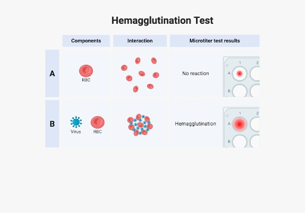

### Theory
A hemagglutination assay (HA) is based on the ability of viruses to bind and aggregate erythrocytes, or red blood cells (RBCs). This assay exploits the natural capability of certain viruses, like influenza and Newcastle disease virus protein haemagglutinin/neuraminidase, to bind to sialic acid receptors present on RBCs. The binding results in the virus linking RBCs together, forming a visible clump.

A hemagglutination assay (HA) is a macroscopically visible assay to detect the presence of hemagglutinating viruses. There is a lattice formation that increases with an increase in virus concentration, which typically settles down in a U-shaped or V-shaped microtiter plate well. In normal conditions without a virus, the RBCs settle down under gravity without the formation of a lattice or clump-like structure. Therefore, one can observe the presence (positive) or absence (negative) of the virus with the naked eye.

**Fig. Schematic representation of the haemagglutination assay showing, A. A Control (compact button of RBCs at the bottom of the V-bottom microtiter plate well, B. A positive result (diffuse mat of RBCs).**